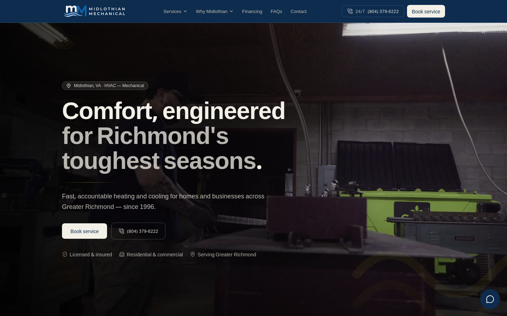
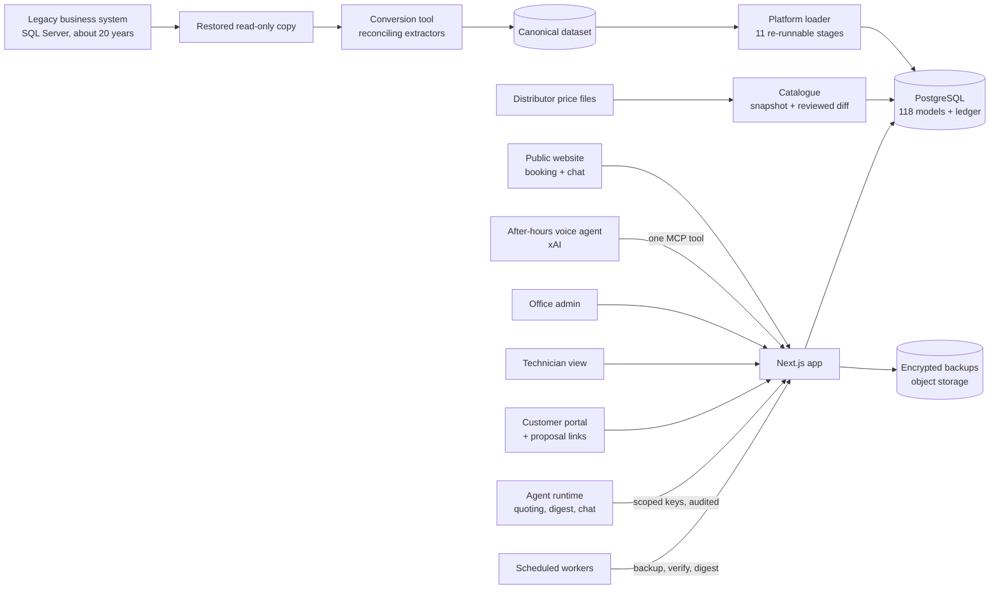
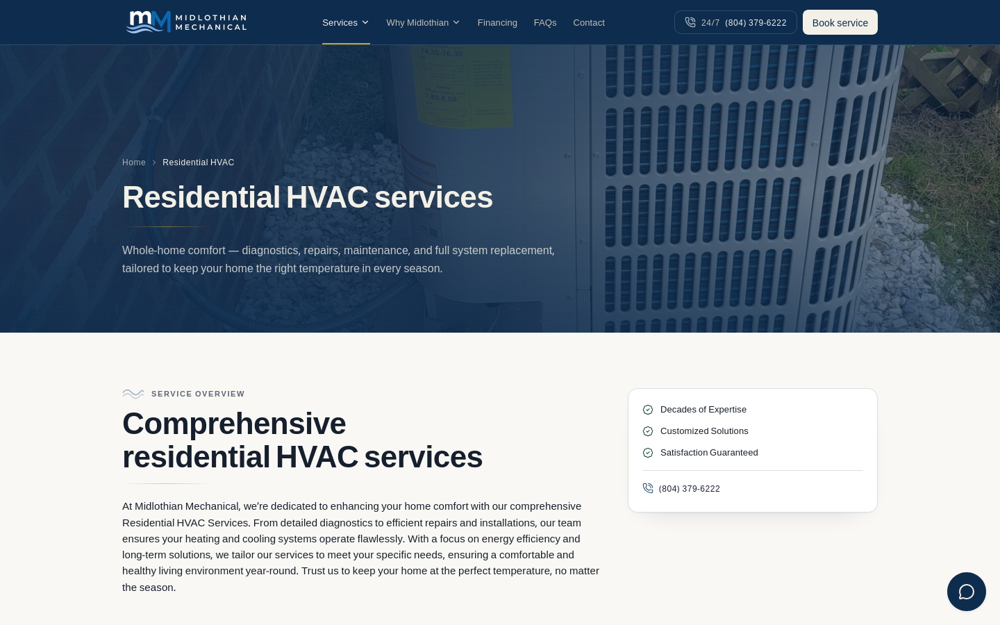
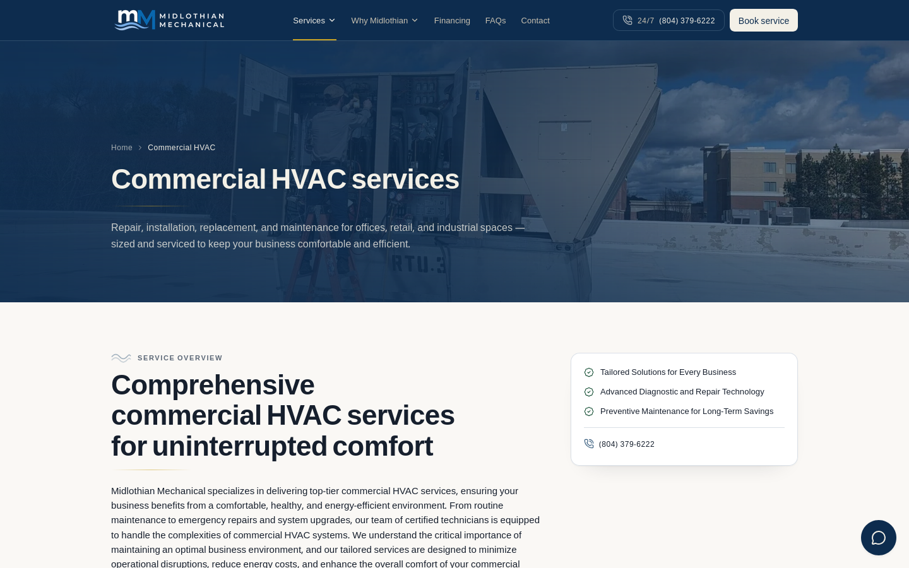

# Midlothian Mechanical

**The operating platform for a Virginia HVAC and plumbing contractor: a new public website, twenty years of business history moved off a legacy system and reconciled to the cent, and AI-assisted quoting where the code, not the model, owns every price.**

Live site: [midlomechanical.com](https://midlomechanical.com)

---

## What it is

Midlothian Mechanical is a residential and commercial HVAC, plumbing and sheet-metal contractor serving the Richmond, Virginia area since 1996. This project is the software the shop runs on: the public website customers find it through, and behind a sign-in, the office platform that holds its customers, service addresses, installed equipment, work history, maintenance agreements, receivables, fleet and proposals.

It replaced a WordPress site and is moving the business off a field-service and accounting system the shop had used for about twenty years. Built by [Emergent AI Agency](https://emergentaiagency.com) (Ryan Chappell).

## Highlights

- **Twenty years of history, moved and proven.** Roughly 11,800 customer accounts, 14,500 service addresses, 9,700 pieces of installed equipment, 164,000 service visits and over a million accounting lines were extracted from the legacy SQL Server system and loaded into PostgreSQL. The load can be re-run without creating a duplicate row, and open receivables match the old system to the cent.
- **Proposals priced from what the shop can actually buy.** The distributor's weekly price files land as dated snapshots behind a reviewed diff. The proposal builder offers ranked, AHRI-certified equipment options for a given address, and reproduces the shop's own installed-price arithmetic to the cent. Customers review and e-sign from a private link, and acceptance re-checks every price before it counts.
- **An AI quoting assistant that never does the maths.** Office staff talk a job through with the assistant. Plain code decides when it has enough information. Every line it drafts must trace back to the price book, a pricing rule or a catalogue item, and totals are calculated outside the model. The assistant can save drafts but has no way to send anything to a customer.
- **A website assistant and an after-hours phone line that turn conversations into booked work.** The site-wide chat answers questions from an approved price sheet and reads equipment nameplates from a photo. It files leads into the office's normal intake queue and emails the office. A voice receptionist built on xAI's voice platform files after-hours calls into the same queue through a single narrowly scoped tool, and tells callers to phone 911 first for gas or carbon-monoxide emergencies.
- **An equipment record the shop can act on.** Brand names are normalised, manufacture dates are decoded from serial numbers, and warranty position is estimated. Addresses are then ranked by equipment age, repair frequency and money already spent, which gives the office a list of likely replacement jobs.
- **The office's daily screens.** A dispatch board for the day (the database refuses to double-book a technician), customer and work-order records with margins, agreement records with visit cadence, receivables aging from the ledger, a fleet module that turns photographed receipts into reviewable drafts, a referral-partner directory, and a read-only customer portal opened with a sign-in link.
- **Encrypted nightly backups that are checked, not assumed.** Every table is exported, encrypted with AES-256-GCM and stored in a dedicated bucket. A scheduled job decrypts and reassembles a backup to prove it can be restored, and an admin screen shows exactly what a restore would change before it runs.

## The brief and the outcome

**What the shop needed.** Proposals took too long and were not accurate enough. The office worked in a system it had used for two decades, which had no practical export to anything modern. The public website was an aging WordPress install with hundreds of thin local-SEO pages, so it under-sold a long-established company.

**What Emergent delivered.**

- A new marketing site with 40 core pages (services, team, awards, financing, a blog), online booking, and the site-wide chat assistant. Every core page kept its old address, and nearly 250 legacy URLs redirect permanently to their nearest new page, so old links and search results still land somewhere useful.
- A conversion tool that reads a restored, read-only copy of the legacy database and turns it into a clean, reconciled dataset, plus a loader that brings it into the new platform.
- The office platform described above, running on the same deployment as the public site.
- A quoting pipeline planned in five phases, four of them built: a supplier catalogue, a cleaned-up equipment record, proposals (internal assembly, the customer's page, and the shop's own installed-price formula), and about 12,900 historical line items recovered from free text inside old visit notes. The fifth, calibrating prices against the shop's measured job times, is next.

**What changed for them.** The new site has been live on the shop's own domain since September 2026, and the office platform behind it holds the full customer, equipment, visit and accounting history. The office opens one screen to see a customer's sites, equipment, agreements and open balance. Proposals start from current distributor costs and the shop's own arithmetic instead of manual data entry. Website and after-hours leads arrive in one queue with an email to the office.

| | |
|---|---|
| **In production** | Public website and booking, website chat assistant, office platform loaded with the full history, dispatch board, proposal builder, fleet, referral directory, encrypted backups |
| **Built, rolling out** | Customer portal (read-only), customer proposal links, after-hours voice receptionist, morning office digest |
| **Next** | Invoicing and online payments, a transactional customer portal, technician mobile workflows |

## Architecture

Everything a person or an agent can reach goes through one Next.js application backed by PostgreSQL. The legacy data never flows in directly. It is extracted from a read-only copy, reconciled, and loaded by a separate pipeline that can be re-run at any time. AI agents get no database access at all: they call the same HTTP endpoints as everything else, with keys scoped to what each agent may read or write. Scheduled work (backups, backup verification, the daily digest) is triggered by small workers rather than an always-on job runner. The app runs on [HostKit](https://github.com/codeslayer44/hostkit-showcase), Emergent's in-house hosting platform.

More detail: [docs/architecture.md](docs/architecture.md).

## Engineering notes

**The dangerous error in a migration is the one that looks right.** The legacy database had 227 tables and only 5 declared foreign keys, so most relationships had to be worked out by hand. Seven wrong joins turned up during the work, and all of them looked the same: a column with an honest name whose parent was a sibling table sharing an overlapping ID range. They would have imported cleanly and surfaced months later in a reconciliation. So the conversion is built to fail loudly when something is left out rather than pass quietly. Every table must declare where its rows go, totals must balance as an arithmetic identity, a check that did not run counts as a failure, and the known-wrong joins are tested to make sure they still produce wrong answers. The extractor refuses any write statement, and government ID columns are never read at all.

**Money is integers, and the database enforces the books.** Amounts are stored as whole cents, and a single module does all rounding. The double-entry rules are not left to application code: database triggers refuse an entry whose debits and credits differ and refuse anything posted into a closed period. The test suite for this writes straight to the database, the way a careless import script would, and checks that each bad write is refused.

**The quoting assistant drafts; code decides.** A language model is good at running the interview and bad at being the final word on price. The job type's checklist decides when an interview is complete, and an answer the model only guessed can never tick a required box. Each drafted line has to name its source (price book, pricing rule or catalogue) and is recomputed from that source. A document that contains a total is rejected, because totals are calculated when the proposal is displayed. Any write that needs approval pauses the agent run and waits for a named admin. The pause is saved in the database, so the run survives a restart. Each agent has an off switch, a per-run cost ceiling and a daily budget.

**A validation rule is a claim about the data, so it gets measured too.** The first plan for dating equipment from serial numbers checked each decoded date against the first service visit ever recorded at that address. Before trusting it, the team measured that rule on units with known install dates: 68.6% were installed after the first visit, because the shop mostly replaces equipment it has already been servicing. The rule would have discarded true dates two times in three. It was replaced by limits that hold by construction. The screens also say "manufactured", never "installed", for a decoded date, and give age as a range where it is uncertain.

**A supplier price can be missing, but it can never be wrong on a quote.** Weekly distributor files are kept as dated snapshots, and nothing changes until a person reviews the diff and commits it. A model missing from this week's file is marked unavailable from that date, not deleted. Unpriced, zero-priced and not-orderable rows are blocked from reaching a proposal by the system's structure, and the test suite proves it. Systems that need a companion part (for example, a ductless system that requires its own controller) carry that part's cost automatically.

## Tech stack

| Layer | Choice |
|---|---|
| App | Next.js 16 (App Router), React 19, TypeScript, Tailwind CSS 4 |
| Data | PostgreSQL, Prisma 7, hand-written constraints and triggers checked by their own test suite |
| Auth | Better Auth; admin roles with per-user permissions, a technician role, and sign-in links for customers |
| AI | OpenRouter Agent SDK with pinned model versions; Fireworks for chat and vision; xAI for speech-to-text and the voice receptionist |
| Agent access | Scoped, hashed API keys over HTTP; one MCP endpoint for the voice agent |
| Email | Resend, with delivery webhooks and a full outbound log |
| Scheduled jobs | Cloudflare Workers calling authenticated cron routes |
| Backups | AES-256-GCM encrypted exports to S3-compatible object storage |
| Legacy conversion | Standalone Node/TypeScript tool reading SQL Server into a canonical SQLite dataset |
| Testing | Vitest, Playwright, and 23 standalone verify suites |
| Hosting | [HostKit](https://github.com/codeslayer44/hostkit-showcase) |

## By the numbers

| | |
|---|---|
| Commits | 753 (2026-07-20 to 2026-10-02) |
| Source lines | about 311,000 |
| Tracked files | 2,205 |
| Database models | 118 |
| SQL migrations | 53 |
| Test files | 165 (Vitest unit tests across the app and the conversion tool, plus a Playwright spec) |
| Verify suites | 23 standalone suites that attack the database, agents and integrations directly |
| History loaded | about 20 years; 164,000+ service visits; 1,069,644 journal lines |

## Screenshots

**Residential HVAC services**

**Commercial HVAC services**

## About this repo

The source code is private. This repository documents the project for prospective clients. Related work: [Kelleher HVAC](https://github.com/codeslayer44/kelleher-hvac-showcase), another HVAC client, and [NextAgent](https://github.com/codeslayer44/nextagent-showcase), the agent control plane Emergent builds with.

Want something like this for your business? Get in touch at [emergentaiagency.com](https://emergentaiagency.com).
