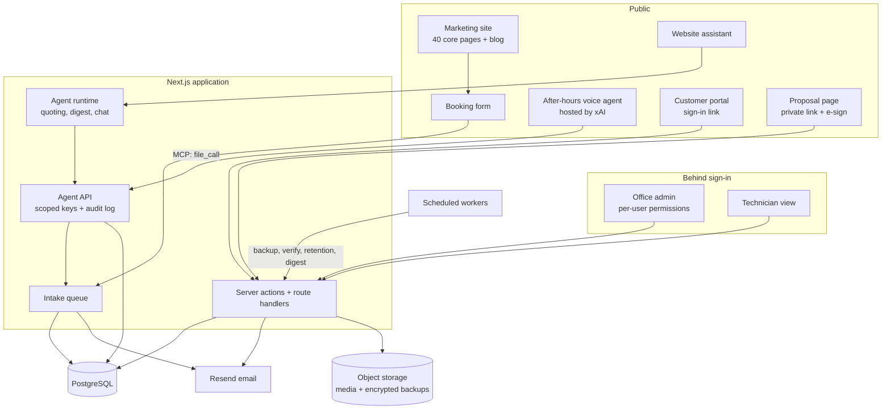
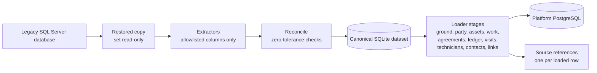
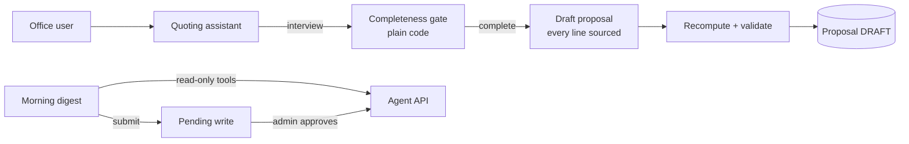

# Architecture: Midlothian Mechanical platform

This page goes one level deeper than the [README](../README.md): the main parts, how data moves between them, and the decisions behind them. It describes design, not source; any code-like shapes below are illustrative.

## 1. System overview



The public website and the office platform are one Next.js application on one deployment. The public pages are prerendered; everything under the office, technician and customer areas is rendered per request behind sign-in.

## 2. Data model

The PostgreSQL schema has 118 models, grouped roughly as:

| Domain | What it holds |
|---|---|
| Parties and places | Customers, service locations, people and contact methods, kept separate so one person can relate to several accounts |
| Work | Work orders, projects, appointments, assignments, technicians, time off, service requests |
| Equipment | Installed units, placements, photos, warranties, and derived facts (age, capacity, warranty position) |
| Agreements | Maintenance agreements, covered equipment, scheduled visits |
| Ledger | Accounts, periods, journal entries and lines, posting rules, business units |
| Catalogue and pricing | Supplier price snapshots, certified system combinations, companion parts, preferred product lines, job types, pricing rules |
| Proposals | Proposal documents, access links, signatures |
| Agents | Agent keys, runs, pending writes awaiting approval, chat sessions, voice calls, AI usage |
| Fleet | Vehicles, drivers, maintenance schedules, fuel, odometer readings, document intake |
| Referrals | Partners, offers, links, click activity, logo permissions |
| Operations | Backups and restores, email log, audit log, cron runs, import provenance |

Some rules matter too much to live only in application code. Constraints and triggers that Prisma cannot express are written by hand, and a dedicated suite (`verify:constraints`) checks that every one of them exists in the live schema. It is the only verify suite safe to run against production, because it only reads.

## 3. Moving twenty years of history



**Never touch the client's live system.** The conversion reads a full backup restored into its own SQL Server instance and set read-only immediately. The extractor also refuses any statement that begins with a write verb, so a mistake cannot become a write.

**Read only what is needed.** Columns are pulled through an explicit allowlist. Government ID numbers were never selected, so they never left the legacy database. Free-text notes are also screened during the load, and anything resembling sensitive payment data is removed.

**Make the output deterministic.** Paging uses keys with explicit ordering, and two independent runs of the full extraction produce byte-identical output. That makes a later re-run a comparison, not a leap of faith.

**Make the load re-runnable.** Every loaded row is matched to its source record through a source-reference table, so a second run updates instead of duplicating. A `--prove` mode loads twice and fails if any table's row count changes. Two drills back this up: one loads, resets and reloads and requires identical counts; the other proves the database refuses to clear demo data in a state where that would be unsafe.

**Reconcile against the books, not a report.** Expected totals are stored as data and compared in integer cents with zero tolerance. Open receivables on the platform's ledger match the legacy system to the cent.

What landed: about 11,800 customer accounts, 14,500 service addresses, 9,700 installed units, 22,800 jobs (work orders and projects), 3,800 agreements, 164,000 service visits, and 326,000 journal entries made up of 1,069,644 lines.

## 4. Money and the ledger

- **One rounding authority.** A single module does every rounding operation, half-up on decimal strings, with tax rounded per line. Amounts are stored as `BigInt` cents.
- **Posting is serialised.** Posting takes a per-organisation, per-period lock and claims gapless document numbers.
- **The database enforces double entry.** A deferred trigger refuses any transaction whose debits and credits differ when it commits. Another refuses posts into a closed period.
- **Receivables come from the ledger.** The office's aging view reads the receivables control account, rather than adding up invoice rows that could drift from it.

```ts
// illustrative: the shape every money figure takes
type Cents = bigint;
interface PricedLine {
  source: "BOOK" | "RULE" | "CATALOGUE" | "AGENT"; // where the figure came from
  sourceRef: string;                                // which book item, rule or snapshot row
  quantity: string;                                 // decimal string, never a float
  unitPriceCents: Cents;                            // recomputed from source on validation
}
```

## 5. The quoting pipeline

The quoting work was planned as five phases, each with its own measurable gate, built one at a time. The first four are built:

1. **Catalogue.** The distributor's two spreadsheet formats are detected by their columns, parsed into one model, and kept as immutable weekly snapshots. A new file shows as a ranked diff (new, changed, vanished) and is committed only by a person. Rows that cannot be quoted safely (unpriced, zero-priced, not orderable, or missing a required companion part's price) cannot reach a proposal.
2. **Equipment record.** Manufacturer names are normalised, serial numbers are decoded into manufacture dates for the brands that matter, and warranty position is estimated. Anything that cannot be decided is labelled unknown, not guessed.
3. **Proposals.** For an address, the builder shows the installed units, picks a system type and size, and offers ranked AHRI-certified options from the shop's preferred product lines. The shop's installed-price formula was rebuilt from one of its real proposals and checked by reproducing every figure on it to the cent. The customer's page is reached by a private, revocable link. Acceptance takes a typed name and a consent statement, and re-checks prices before it records anything.
4. **Recovered line items.** About 12,900 historical line items existed only as machine-written text inside 7,858 visit write-ups. A rule-based parser turns them into a queryable table. Lines it cannot parse are counted and shown, never silently dropped. The table is labelled as analysis and nothing invoices from it.
5. **Calibration (next).** Comparing the shop's measured job times and realised rates with the price book's generic ones, and requiring a reason when a price departs from the book.

**Replacement pipeline.** Addresses are scored by equipment age × (1 + repairs in the last three years) × (1 + revenue in thousands). Every factor appears next to the score on screen. An address whose equipment age is unknown gets no score, because ranking it either first or last would be a claim the data does not support.

## 6. Agents



- **One door to the models.** A single runtime module wraps the agent SDK, and a test fails the build if anything else imports it. Model versions are pinned to dated IDs, each with an allowed provider list, and a request with no allowed provider is refused before it is sent.
- **No database handles.** Every agent tool is an HTTP call to the app's own agent API, made with a hashed, scoped key. Each request is written to an audit log, and if that write fails, the data is not returned.
- **Human approval is part of the data model.** A tool that needs approval pauses the run and creates a pending-write record. Only an admin with agent permissions can approve it, and the agent has no way to approve itself. Because the paused state lives in the database, any server process can resume the run.
- **Limits are layered.** Each run is capped on steps, repeated identical tool calls and cost. Each agent has a daily budget and its own off switch, and turning a switch off also stops runs already in progress.
- **The daily digest shows its working.** It reads receivables aging, unbilled work, agreement exceptions, stale service requests and the fleet review queue. Every figure it reports must name the tool result it came from, and it is told not to do arithmetic.
- **The website assistant is checked after every turn.** If it states a dollar figure that is not on its approved price sheet, the session is flagged for review. Nameplate photos get a single vision call that only transcribes the plate. Plain code then works out the unit's age and size from the transcription.
- **The phone line has one tool.** The voice receptionist reaches the platform through an MCP endpoint that exposes a single `file_call` tool, using a key that can only file calls. A hang-up still files a record, and the receptionist only tells a caller the office has their details after the platform confirms it saved them.

## 7. Backups and restore

- **What and how.** A logical export of every table, compressed per table, with SHA-256 checksums and a digest at the end of the file. Encryption is AES-256-GCM in fixed-size frames. Data keys are wrapped by a master key, with a recovery passphrase as a second way in. The manifest is authenticated before anything else is read.
- **Where.** A dedicated object-storage bucket with its own credentials, separate from media.
- **Checked, not assumed.** Scheduled workers trigger nightly backup, retention and verification. Verification fully decrypts and reassembles an artifact; a corrupt one is quarantined and raises an alert. The retention planner is a pure, tested function, and it deletes nothing if the result would leave no restorable backup.
- **Restore with eyes open.** The restore screen shows what will change before anything happens and pushes for a fresh safety backup first. An offline restore path needs only the bucket and a key.

## 8. Verification

Besides 165 unit-test files, the platform has 23 standalone verify suites. Each writes real rows to a database and tries to break the rule it guards. Examples:

| Suite | What it attacks |
|---|---|
| `verify:ledger` | Unbalanced entries, posts into closed periods, and other bad writes, made directly as an import script would |
| `verify:agents` | Every key state against every agent route, approval lifecycle, kill switches, spend caps, resuming in a new process |
| `verify:catalogue` | Price-file parsing, diffs, and unquotable rows trying to reach a quote |
| `verify:proposal` / `verify:customer-proposal` | Price provenance, document validity, link access, acceptance when prices have changed |
| `verify:backups` | Encryption, framing, tampering, retention coverage |
| `verify:voice` | Phone intake end to end: one email per call, no customer record created, hang-ups still filed |
| `verify:constraints` | Every hand-written database constraint and trigger exists in the live schema |

## 9. Hosting and delivery

The app runs on [HostKit](https://github.com/codeslayer44/hostkit-showcase), Emergent's in-house hosting platform. Production builds come from a script that refuses a branch other than `main`, a dirty working tree, or a commit not yet pushed. It then inspects the built output to confirm the canonical domain and analytics tag are baked in before anything ships. Scheduled jobs run as small Cloudflare Workers that call authenticated routes on the app.
